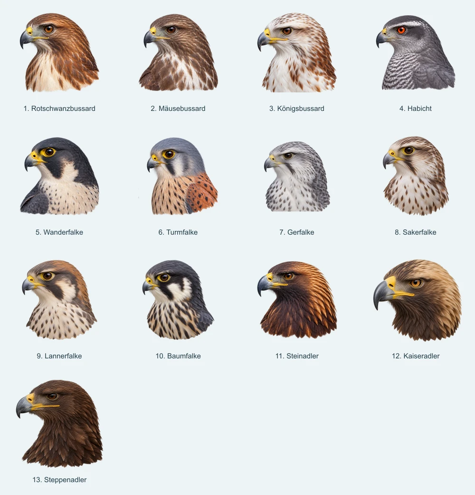
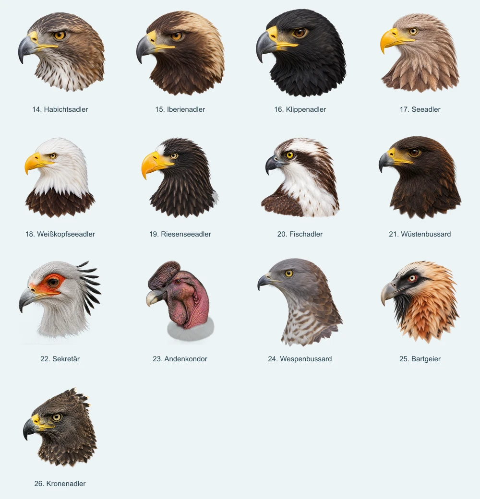
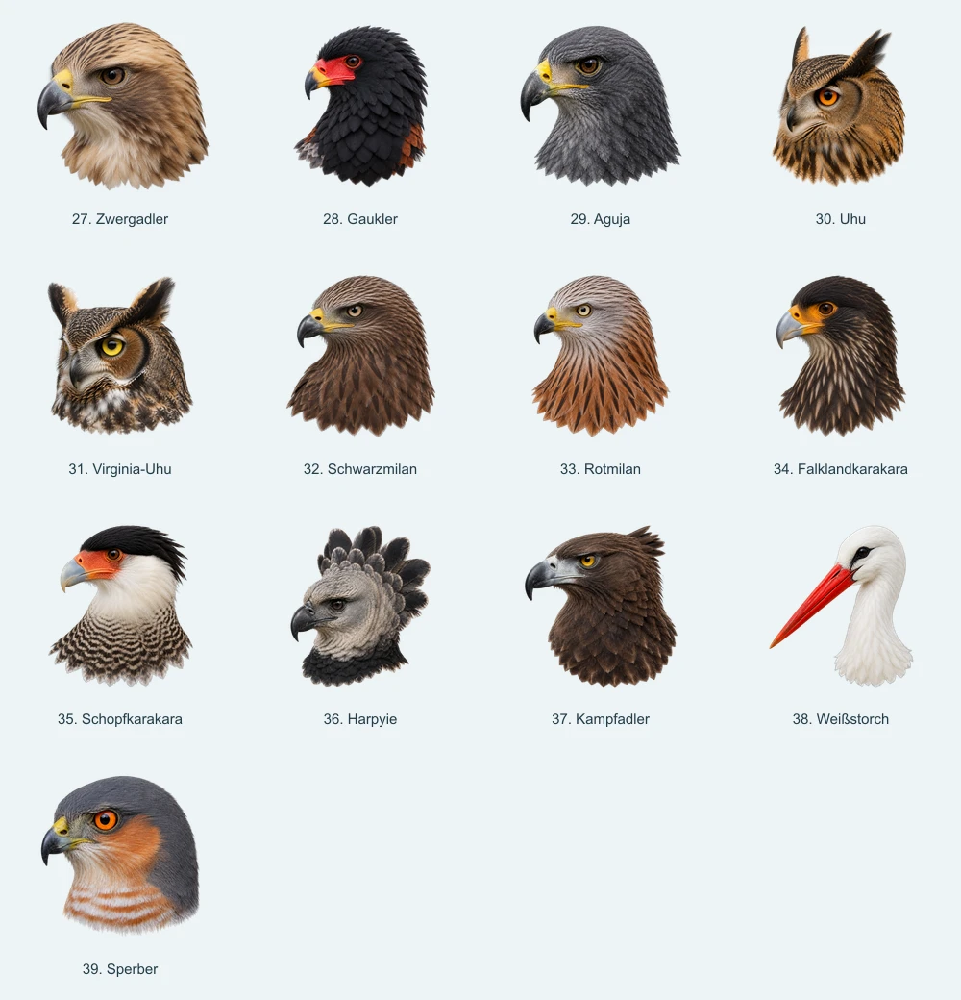

# Porträt-Audit: ein gemeinsamer Darstellungstyp

Stand: 9. September 2026. Alle 39 aktuell in `lib/portrait-images.ts` zugeordneten Originale visuell geprüft; zusätzlich transparente Bildgrenzen und die wirksamen Größenregeln der Artenliste untersucht. Dies ist eine Gestaltungsempfehlung, keine vollständige ornithologische Prüfung aller Illustrationen. Es wurden keine Produktbilder oder UI-Regeln verändert.

## Empfehlung

Ein naturalistisches Kopfporträt mit kurzem Halsansatz, linksgerichtetem Blick, weichem gerichtetem Licht und transparenter, natürlich auslaufender Federkontur. Der Kaiseradler liefert die Referenz für den Ausschnitt. Aguja und Wüstenbussard ergänzen die Referenz für Detailgrad und Kontrast. Die Anatomie wird aus eigenen Referenzen jeder Art bestimmt.

Die letzte Überarbeitung hat die Kopfgröße verbessert, aber Habichts-, Iberien-, Klippen- und Zwergadler eine zu ähnliche Stirn-, Augen-, Wangen- und Schnabelgeometrie gegeben. Diese Ähnlichkeit darf nicht allein durch weitere Farbänderungen bearbeitet werden. Gleichzeitig dürfen natürlich ähnliche Arten keine erfundenen Unterscheidungsmerkmale bekommen.

## Gemeinsame Bildregeln — Vorschlag

- Quadratische transparente PNGs, einheitliche Auflösung, vollständiger Schnabel und alle charakteristischen Kopffedern.
- Kopf und kurzer Halsansatz; Schultern, Flügelansatz und breite Brustfläche entfallen.
- Vergleichbare optische Größe des eigentlichen Kopfes. Eine gleich große Gesamt-Silhouette reicht nicht: Ein langer Hals, ein Schopf oder ein Schnabel kann sonst den Kopf wieder verkleinern.
- Bei gewöhnlichen Greifvogelköpfen als Ausgangspunkt: Auge ungefähr bei 35–42 % der Bildhöhe, gesamte Kontur ungefähr innerhalb 80–90 % der Bildfläche in ihrer längsten Richtung. Dies sind Gestaltungskorridore, keine anatomischen Messwerte oder bereits angewendeten Transformationen.
- Ähnliche Blickrichtung und leichte Dreiviertelansicht, aber artspezifische Kopfform, Haltung und Augenstellung. Für Eulen den Gesichtsschleier, für Haubenträger die charakteristische Kontur erhalten.
- Ein gemeinsames Licht, natürliche Farbsättigung, gut lesbare Federgruppen, dezente Glanzpunkte. Keine Mischung aus weichem Aquarellrand, hartem Fotoausschnitt und überzeichneten Federplatten.
- Unterer Abschluss aus kurzen natürlichen Federspitzen; keine horizontale Schnittkante, kein geometrischer Sockel und kein Weißnebel am Rand.
- Im Export normalisieren, danach im Produkt eine gemeinsame Größenregel verwenden. Vorhandene artspezifische CSS-Korrekturen erst nach dem Bildabgleich entfernen bzw. begründet dokumentieren.

## Technischer Befund

Die Artenliste verwendet grundsätzlich 70 × 70 px, unterhalb der Breakpoints 56 bzw. 54 px. Drei Sonderregeln verändern den Bildmaßstab zusätzlich: Steppenadler 90 %, Gerfalke 114 %, Sperber ungefähr 87 %. Diese Faktoren sind keine Kopfgrößen-Normalisierung.

Bei einem 70-px-Rahmen ergeben sich aus der sichtbaren Alpha-Silhouette (Schwelle > 127) ungefähr:

| Porträt | Sichtbare Breite × Höhe | Einordnung |
| --- | --- | --- |
| Kaiseradler | 63,5 × 59,1 px | Großer Kopf, kurzer Hals |
| Steinadler | 57,4 × 55,4 px | Zusätzlich viel Hals innerhalb der Kontur |
| Steppenadler | 56,4 × 56,7 px | Viel Hals und zusätzliche CSS-Verkleinerung |
| Habichtsadler | 62,1 × 56,7 px | Ausschnitt passt, Anatomie gesondert bearbeiten |
| Iberienadler | 62,9 × 60,5 px | Ausschnitt passt, Kopf wirkt schematisch |
| Klippenadler | 64,4 × 62,9 px | Etwas kräftigerer Gesamteindruck als die Referenz |
| Sperber | 49,0 × 49,7 px | Durch CSS deutlich kleiner |

Die Werte beschreiben die Gesamt-Silhouette, nicht die Größe des Schädels. Die Kopfgröße wurde visuell beurteilt. Die folgenden Kontaktbögen zeigen alle Quelldateien in gleich großen Rahmen ohne artspezifische CSS-Skalierung, damit Unterschiede im Bild selbst erkennbar werden.

## Sichtung aller 39 Arten

**Ausschnitt** bedeutet: vorhandene Identität und Zeichnung erhalten; Hals/Brust kürzen, Kopf größer und neu zentriert platzieren. Falls eine bloße Umrahmung einen harten Schnitt erzeugt, nur den unteren Federabschluss gezielt nacharbeiten.

**Anatomie** bedeutet: aktueller Ausschnitt ist brauchbar, aber ein eigenständiger Kopf muss anhand echter Referenzen derselben Art ausgearbeitet werden. **Stil** bedeutet: Textur, Licht oder Randabschluss angleichen. **Behalten** bedeutet: kein grundsätzlicher Neuentwurf; abschließende optische Feinjustierung bleibt möglich.

### 1–13: Bussarde, Habicht, Falken und erste Adler

| Art | Empfehlung | Konkrete Änderung |
| --- | --- | --- |
| Rotschwanzbussard | Ausschnitt | Lange Brustpartie kürzen; Kopfzeichnung und warmen Farbcharakter erhalten. |
| Mäusebussard | Ausschnitt | Schulterbreite und Brust reduzieren; der kleine Kopf soll die Darstellung bestimmen. |
| Königsbussard | Ausschnitt | Weiße Brustfläche verkürzen; Gesicht größer zeigen, helle Zeichnung erhalten. |
| Habicht | Ausschnitt | Breite Schulter-/Brustbasis entfernen; kantige Kopfsilhouette und Augenbetonung bewahren. |
| Wanderfalke | Ausschnitt | Sichtbare Schulter entfernen; Kopf, Wange und Bartstreif deutlich größer. |
| Turmfalke | Ausschnitt | Rostfarbene Schulter und langen Hals zurücknehmen; kleiner Falkenschnabel bleibt proportioniert. |
| Gerfalke | Ausschnitt | Gesicht statt Brust dominant machen; die 114-%-CSS-Korrektur anschließend neu bewerten. |
| Sakerfalke | Ausschnitt | Langen getropften Hals kürzen, Kopf optisch vergrößern; kein pauschaler Adlerkopf. |
| Lannerfalke | Ausschnitt | Brust kürzen; Kopfkappe und Gesichtsmuster erhalten. |
| Baumfalke | Ausschnitt | Längliche Brustfläche kürzen; vorhandene Gesichtskontraste beibehalten. |
| Steinadler | Ausschnitt, zuerst | Kopf deutlich größer, Hals kürzer. Eigenen Schnabel und goldenen Nacken erhalten; warme Federfarben im gemeinsamen Licht prüfen. |
| Kaiseradler | Behalten / Referenz | Kopfgröße und kurzer Hals passen. Dient als Kompositionsreferenz; keine Anatomieschablone für andere Arten. |
| Steppenadler | Ausschnitt, zuerst | Kopf größer und Hals kürzer; 90-%-CSS-Regel nach dem Abgleich entfernen. Eigenes flacheres Profil und Mundwinkel anhand eigener Fotos bewahren. |

### 14–26: neue Adler und weitere Gruppen

| Art | Empfehlung | Konkrete Änderung |
| --- | --- | --- |
| Habichtsadler | Anatomie, zuerst | Eigenes Stirn-/Schnabelprofil, Augenpartie und Kopfproportionen aus Artenreferenzen erarbeiten; gegenwärtige helle Kehle allein schafft zu wenig Eigenständigkeit. |
| Iberienadler | Anatomie, zuerst | Mit Kaiseradler zusammen vergleichen; Unterschiede aus Referenzen übernehmen, gemeinsame Merkmale zulassen. Keine künstliche Unterscheidung durch andere Pose oder Fantasiefarben. |
| Klippenadler | Anatomie, zuerst | Kopfprofil und Schnabelansatz eigenständig ausarbeiten; Schwarzfärbung nicht als einzige Abgrenzung verwenden. Größe an Kaiseradler ausbalancieren. |
| Seeadler | Ausschnitt | Langen Hals kürzen, Gesicht vergrößern; kräftigen gelben Schnabel erhalten. |
| Weißkopfseeadler | Ausschnitt | Braunen Brust-/Halsanteil zurücknehmen; weißer Kopf soll deutlich mehr Fläche bekommen. |
| Riesenseeadler | Ausschnitt | Halsfächer kürzen und Gesicht größer setzen; den arttypisch markanten Schnabel nicht an andere Adler angleichen. |
| Fischadler | Ausschnitt | Schulter entfernen und Gesicht vergrößern; Augenstreif und vorhandene Kopfform sind bereits eigenständig. |
| Wüstenbussard | Behalten / Referenz | Kompakter Ausschnitt und eigenständiger Ausdruck; nur im abschließenden Größenvergleich feinjustieren. |
| Sekretär | Stil | Sehr weichen, weiß auslaufenden Halsabschluss angleichen. Kopffedern vollständig erhalten, Gesicht vor dem Schopf optisch gewichten. |
| Andenkondor | Stil | Grauen kragenartigen Sockel natürlicher ausarbeiten; Hautstruktur und Kragen in Licht und Schärfe an die Serie angleichen. Charakteristischen kahlen Kopf erhalten. |
| Wespenbussard | Stil, zuerst | Deutlich matter und weicher als die übrigen Bilder; Konturen, Federgruppen und Gesicht klarer modellieren. Eigenen schlanken Kopf erhalten. |
| Bartgeier | Behalten | Starke eigene Identität und brauchbarer Kopfanteil; Bart und Kopfform erhalten, Licht/Farbstärke nur fein abstimmen. |
| Kronenadler | Behalten | Kopfporträt funktioniert; Haube nicht zugunsten einer runden Einheitskontur verlieren. Optische Kopfgröße separat von der Haubenhöhe beurteilen. |

### 27–39: übrige Arten

| Art | Empfehlung | Konkrete Änderung |
| --- | --- | --- |
| Zwergadler | Anatomie | Kopfgröße passt. Kopf-/Schnabelverhältnis anhand eigener Fotos prüfen und vom großen Aquila-Schema lösen. |
| Gaukler | Behalten | Gut erkennbare eigene Kontur, kurzer Kopf und rote Gesichtspartie; kein grundsätzlicher Umbau. |
| Aguja | Behalten / Referenz | Kompaktes Gesicht, stimmige Federdetailgröße und eigenständige Form; gute zweite Stilreferenz. |
| Uhu | Behalten | Gesichtsschleier und Ohrfedern erhalten; bei der Größenabstimmung die Gesichtsscheibe beurteilen. |
| Virginia-Uhu | Behalten | Eigenen Gesichtsschleier erhalten; mit Uhu als Paar auf vergleichbare Gesichtsgröße abstimmen. |
| Schwarzmilan | Ausschnitt | Langen Halsfächer kürzen und Gesicht größer setzen. |
| Rotmilan | Ausschnitt | Rostfarbenen Hals verkürzen, grauen Kopf prominenter zeigen; eigene schmale Kopfform erhalten. |
| Falklandkarakara | Ausschnitt | Langen gestreiften Hals verkürzen, Gesicht stärker gewichten; Karakara-Profil bewahren. |
| Schopfkarakara | Ausschnitt | Brust/Schulter reduzieren; Kopfkappe, helle Wange und Gesichtshaut erhalten. |
| Harpyie | Behalten | Gesicht und Haube als charakteristische Einheit erhalten. Für die Größenprüfung den Kopf unterhalb der Haube betrachten. |
| Kampfadler | Behalten | Kopfanteil und kompakter Abschluss sind brauchbar; nur gemeinsamer Schlussabgleich. |
| Weißstorch | Sonderkomposition | Hals kürzen und Gesicht soweit möglich größer zeigen. Vollständiger langer Schnabel braucht weiterhin Raum; keine Adlerproportionen erzwingen. |
| Sperber | Ausschnitt + Skalierung | Brust verkürzen und Kopf leicht prominenter setzen; zusätzliche ca. 87-%-CSS-Verkleinerung im gemeinsamen Größenabgleich auflösen. |

Bilanz: 10 weitgehend behalten, 21 primär am Ausschnitt anpassen, 4 anatomisch gezielt überarbeiten, 3 stilistisch angleichen, 1 Sonderkomposition.

## Vorgehen zur Konvergenz

1. **Referenzstreifen festlegen:** Kaiseradler, Aguja und Wüstenbussard unverändert nebeneinander. Dazu Uhu und Harpyie als Beispiele für bewusst andere Anatomie innerhalb derselben Bildsprache.
2. **Kleine Pilotserie:** Steinadler und Steppenadler für den Ausschnitt; Habichtsadler für eigenständige Adleranatomie; Wanderfalke für eine andere Kopfform; Wespenbussard für die Stilkorrektur. Gegen den Referenzstreifen und echte Fotos derselben Art prüfen.
3. **Verwandte Arten gemeinsam abgleichen:** Besonders Kaiser-/Iberienadler sowie Habichts-/Klippen-/Zwergadler. Je Art mehrere alters- und morphenpassende Referenzfotos verwenden. Erst individuelle Anatomie bestimmen, dann den gemeinsamen Stil anwenden.
4. **Restliche Ausschnitte gruppenweise bearbeiten:** Bussarde, Falken, Seeadler, Milane/Karakara. Bestehende Gesichter soweit möglich bewahren. Die Reihenfolge darf nicht dazu führen, dass ein zuletzt erzeugter Vogel zum Anatomiemuster aller folgenden wird.
5. **Abnahme in tatsächlicher Größe:** Alle 39 bei 70 und 54 px, auf hellem und dunklem Hintergrund sowie ohne Beschriftung vergleichen. Kopfgröße, Eigenständigkeit, Licht, Rand und Transparenz jeweils getrennt beurteilen. Danach Skalierungs-Sonderregeln bereinigen.

Nicht alle Arten werden allein am Kopf eindeutig bestimmbar. Beispielsweise gehören beim Zwergadler auch helle Schulterflecken zu den hilfreichen Merkmalen, die im engen Kopfporträt fehlen. Ähnlichkeit dort akzeptieren, wo sie biologisch begründet ist; die Illustration soll keine falsche Eindeutigkeit erzeugen.

## Fachliche Referenzen für die nächste Bildrunde

- [Cornell: Steinadler, Bilder und goldener Nacken](https://www.allaboutbirds.org/guide/Golden_Eagle/id)
- [eBird: Steppenadler, Artenbilder](https://ebird.org/species/steeag1)
- [eBird: Habichtsadler, Artenbilder](https://ebird.org/species/boneag2)
- [SEO/BirdLife: Iberienadler](https://seo.org/ave/aguila-imperial-iberica/)
- [SANBI: Klippenadler](https://www.sanbi.org/animal-of-the-week/verreauxs-eagle/)
- [eBird: Zwergadler, Morphen und Schultermerkmale](https://ebird.org/species/booeag1)

Die gestalterischen Urteile in der Tabelle stammen aus der Sichtung der Projektbilder. Die Quellen liefern Artenreferenzen; vor einer anatomischen Neuzeichnung müssen passende Fotoansichten im Detail verglichen werden.
