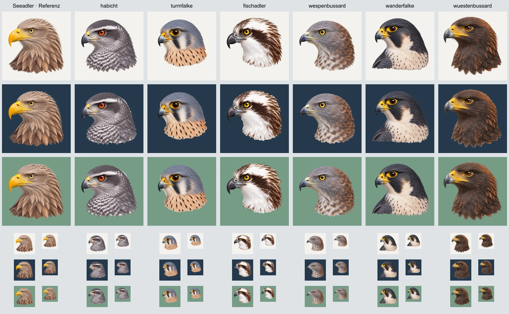

# Porträt-Pilotserie vom 12. September 2026

> Historischer Zwischenstand: Die anschließende Nutzerprüfung hat die Beurteilung der Halsproportionen von Turmfalke und Wanderfalke widerlegt. Diese Aussagen sind keine gültige Abnahme. Verbindliche Kompositionsreferenz ist inzwischen der bestätigte Habicht; siehe `../portrait-habicht-reference-20260912/` und `../portrait-refinement-20260912/`.

Sechs vorhandene Porträts überarbeitet und in `lib/portrait-images.ts` versioniert zugeordnet. Alte Originale bleiben erhalten. Keine zusätzlichen Arten oder Geschlechtsvarianten. Erzeugung mit dem eingebauten Imagegen-Werkzeug; Prompts, aktive Originalpfade, SHA-256-Prüfsummen, Referenzrollen und Ausgabepfade stehen in `manifest.json`.

## Referenz und Raster

Der vom Nutzer bestätigte Seeadler ist die Hauptreferenz für Illustration und Komposition. Beim Turmfalken ergänzt der ebenfalls bestätigte Wanderfalke ausdrücklich den Vergleich der Halsproportionen innerhalb der Falken. Andere Arten liefern keine Anatomie. Der Nutzer bestätigt den Wüstenbussard mit der einzigen Korrektur: etwas heller.

Alle Leinwände bleiben 1254 × 1254 px. Verglichen wird die optische Kopfgröße, nicht nur die gesamte Silhouette. Der Kopf wird nach dem Kürzen des Halses nicht automatisch auf die alte Gesamthöhe vergrößert. Genau dieser Fehler führte zur Ablehnung des ersten Turmfalken. Die zweite Fassung zeigte erneut zu viel Brust und wurde ebenfalls verworfen. Die eingebundene dritte Fassung hält die Kopfgröße nahe am Original und endet mit mäßig kurzem Halsansatz; der zusätzliche freie Raum unterhalb ist beabsichtigt. Keine Schulter-/Flügelpartie mehr. Der Fischadler wurde auf der Leinwand um 55 px nach oben versetzt, um seine Augenhöhe an die Serie anzugleichen.

## Prüfung gegen den Vogelbild-Standard

| Kriterium | Prüfung und Ergebnis |
| --- | --- |
| Aktive Quelle | Alle sechs Originale aus `lib/portrait-images.ts` ermittelt; Prüfsummen im Manifest. |
| Blick und Perspektive | Alle sechs linksgerichtet mit leichter Drehung; bestehende arttypische Kopfform erhalten. |
| Kopfgröße und Hals | Direkter Vergleich mit Seeadler und Wanderfalke; Turmfalke nach zwei verworfenen Fassungen korrigiert. Fischadler ohne die alte lange Brust-/Schulterpartie; Habicht mit natürlichem unteren Abschluss; Wespenbussard mit kürzerem Hals. |
| Schnabel und Federn | Vollständige Schnäbel, Kronen und Randfedern; alle sichtbaren Konturen innerhalb der Leinwand. |
| Unterer Abschluss | Natürlich entlang der Federn; kein Sockel, weißer Nebel oder gerader geometrischer Schnitt. |
| Bildsprache | Naturalistische Illustration mit sichtbarer Federstruktur; Artmerkmale aus den jeweiligen Originalen beibehalten. |
| Transparenz | Eingebrannte Schachbretter lokal segmentiert; Alpha und Kompositionen auf warmweißem, dunkelblauem und grünem Hintergrund kontrolliert. Keine sichtbaren Schachbrettreste oder Löcher in hellen Gefiederflächen. |
| Wüstenbussard | Nur Aufhellung; ursprünglicher Alpha-Kanal pixelidentisch (0 abweichende Alpha-Werte), gleiche Leinwand und Außenkontur. |
| Anzeigegröße | Alle finalen Bilder im Kontaktbogen bei 64 und 48 px geprüft. Die tatsächliche Artenleiste im Browser nutzt die neuen optimierten Quellen bei 64 px. |

Die Prüfung betrifft die konkrete Bildkorrektur und den Projektstandard; die Artmerkmale wurden gegenüber den bestehenden Originalen verglichen.

## Lokale Freistellung

`finish.py` verwendet je Bild eine eigene, am generierten Vogel nachgezeichnete grobe Kontur. Daraus entstehen geschützter Innenbereich und ein schmaler unsicherer Rand für GrabCut. Helles Gefieder wird nicht anhand seiner Farbe gelöscht. Zusammenhängender Vogel, geschlossene innere Maske, weicher Subpixelrand und Entfernung verunreinigter Randfarben innerhalb von zwei Pixeln. Beim Wüstenbussard übernimmt `scripts/restore-bird-alpha.mjs` die unveränderte Originalmaske. Das Manifest enthält die technischen Alpha- und Größenmessungen der finalen PNGs.

## Prüfabbildung

Oben je drei Hintergründe, unten jeweils 64 und 48 px. Neu erzeugbar mit `node docs/portrait-pilot-20260912/contact-sheet.mjs` vom Projektverzeichnis.

## Projektprüfungen

- `npm run images`: erfolgreich; neue optimierte Bildquellen erzeugt.
- Lokaler Browser: neue Quellen aller sechs Arten und 64-px-Anzeige verifiziert; Turmfalke, Habicht, Wanderfalke, Fischadler und Wüstenbussard in der Artenleiste visuell geprüft.
- `npm run lint`: Design-System-Prüfung erfolgreich; gesamter Lint scheitert an vier bestehenden Fehlern in unveränderten `components/ui/carousel.tsx` und `components/ui/chart.tsx`.
- `NETLIFY=true npm run build`: erfolgreich einschließlich 45 vorgerenderter Routen und Nachbearbeitung. Der temporäre lokale Prerender-Server erforderte die Ausführung außerhalb der Sandbox.
- `git diff --check`: erfolgreich.
